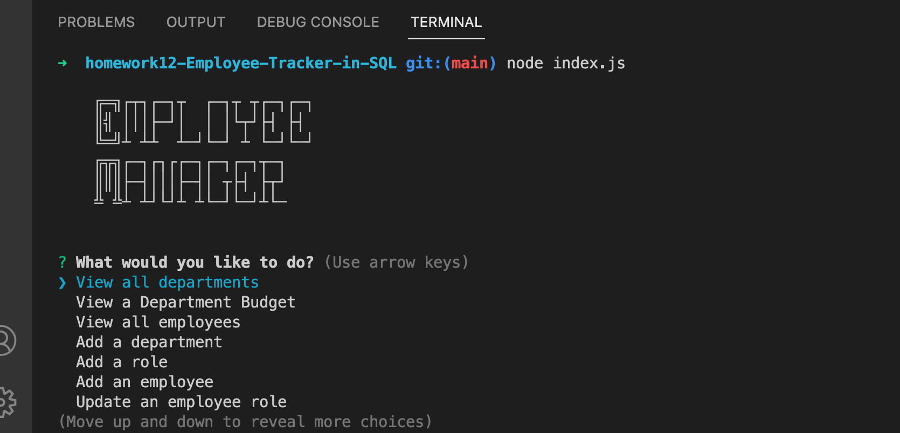

# Project Name - Employee Tracker in SQL

## Table of contents

- [Overview](#overview)
  - [The challenge](#the-challenge)
  - [User Story](#user-story)
  - [Acceptance Criteria](#acceptance-criteria)
  - [Screenshot](#screenshot)
  - [Video Instructions](#video-instructions)
  - [Links](#links)
- [My process](#my-process)
  - [Built with](#built-with)
  - [What I learned](#what-i-learned)
  - [Useful resources](#useful-resources)
- [Author](#author)
- [Acknowledgments](#acknowledgments)


## Overview

### The challenge

Build a command-line application from scratch to manage a company's employee database, using Node.js, Inquirer, and MySQL.

### User Story

```md
AS A business owner
I WANT to be able to view and manage the departments, roles, and employees in my company
SO THAT I can organize and plan my business
```

### Acceptance Criteria

```md
GIVEN a command-line application that accepts user input
WHEN I start the application
THEN I am presented with the following options: view all departments, view all roles, view all employees, add a department, add a role, add an employee, and update an employee role
WHEN I choose to view all departments
THEN I am presented with a formatted table showing department names and department ids
WHEN I choose to view all roles
THEN I am presented with the job title, role id, the department that role belongs to, and the salary for that role
WHEN I choose to view all employees
THEN I am presented with a formatted table showing employee data, including employee ids, first names, last names, job titles, departments, salaries, and managers that the employees report to
WHEN I choose to add a department
THEN I am prompted to enter the name of the department and that department is added to the database
WHEN I choose to add a role
THEN I am prompted to enter the name, salary, and department for the role and that role is added to the database
WHEN I choose to add an employee
THEN I am prompted to enter the employee’s first name, last name, role, and manager, and that employee is added to the database
WHEN I choose to update an employee role
THEN I am prompted to select an employee to update and their new role and this information is updated in the database
```

### Screenshot



### Video Instructions

- A video on how to operate Emplyee Manager: [Demo video](https://drive.google.com/file/d/12TdjP69-rLLF5MRDFxwKs2l6HZJhF7mh/view)


### Links

- Solution URL: [GitHub Repo](https://github.com/NaNifer/Employee-Tracker-in-SQL)

## My process

### Built with

NodeJS
- JavaScript
- NPM Inquirer
- NPM console.table
- SQL​
- MySQL2

### What I learned

I learned a lot about both sql, retreiving a putting data into a database, and the need for async functions when running code.

Some of the syntax for sql was new to me. For example, a fellow classmate taught me that set ON DELETE SET NULL for a foreign key was important. When a foreign key is "set null on delete", then if a record in the parent table is deleted, then the corresponding records in the child table will have the foreign key fields set to NULL. This way, the records in the child table will not be deleted in SQL Server.

I also learned more about setting aliases in a db query. While useing inquirer, it needed keys of "name" and "value" in order to work. By creating aliases with sql with corrasonding names to the inquirer keys, I was able to access the data with very little extra code.

### Useful resources

- [ASCII Font Generator](https://patorjk.com/software/taag/#p=display&f=Graffiti&t=Type%20Something%20) - You can type in text, and it will display it in a variety of ASCII fonts to choose from.


## Author

- GitHub - [NaNifer](https://github.com/NaNifer)
- Portfolio - [Nifer Kilakila](https://nanifer.github.io/Nifer-Kilakila-Portfolio-h2/)

## Acknowledgments

My classmate Nolan suggested console.table for displaying queries, and clear up my major confusion about how exporting/inporting functions actually work. Also a shout out to [nullaus](https://github.com/nullaus) who helped me understand hoistin, infinite loops,  and asychronous queries.